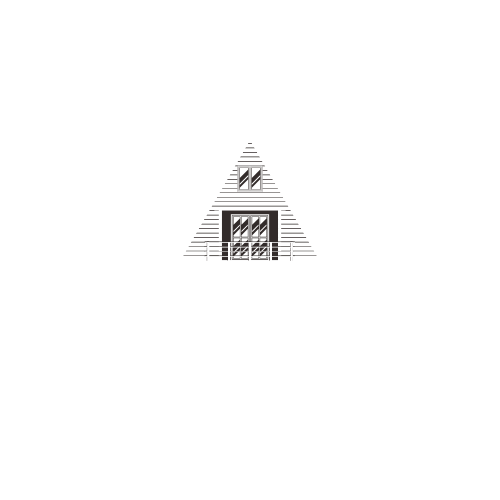

# 🏠 BashaLagbe - Your Perfect Home Awaits

<div align="center">
  
  
  
  *A modern web-based house rental platform designed specifically to help people find their ideal rental homes*
  
  [](https://choosealicense.com/licenses/mit/)
  [](https://nodejs.org/)
  [](https://reactjs.org/)
  [](https://www.mongodb.com/)
  
</div>

---

## ℹ️ About BashaLagbe

Initially created to aid student accommodation, **BashaLagbe** is a comprehensive web-based house rental platform designed to eliminate the difficulty in finding your secure abode. The name "বাসা লাগবে" (Basha Lagbe) means "need a house" in Bengali, reflecting our mission to help people find their ideal rental homes with ease and confidence.

### 🎯 Why Choose BashaLagbe?

- 🔍 **Smart Search**: Advanced property search
- 🔐 **Secure Platform**: Robust authentication and data protection
- 💰 **Bidding System**: Competitive pricing through bid management
- 📱 **Responsive Design**: Perfect experience on the web
- 🚀 **Fast & Reliable**: Built with modern technologies for optimal performance

---

## 🛠️ Tech Stack

<div align="center">

| Frontend | Backend | Database | Tools |
|----------|---------|----------|-------|
|  |  |  |  |

</div>

### 🔧 Key Technologies

- **Frontend**: React.js with modern hooks and components
- **Backend**: Express.js & Node.js for robust server-side logic
- **Database**: MongoDB for flexible data storage
- **Features**: Image gallery, authentication system, file upload handling

---

## 🚀 Quick Start Guide

### Prerequisites
- Node.js (v14 or higher)
- MongoDB
- npm

### 📥 Installation

1. **Clone the repository**
   ```bash
   git clone https://github.com/Imtela04/BashaLagbe.git
   cd BashaLagbe
   ```

2. **Install Backend Dependencies**
   ```bash
   cd backend
   npm install
   cd ..
   ```

3. **Install Frontend Dependencies**
   ```bash
   cd frontend
   npm install
   cd ..
   ```

### 🎉 Running the Application

1. **Start the Backend Server**
   ```bash
   cd backend
   npm start
   ```

2. **Start the Frontend (New Terminal)**
   ```bash
   cd frontend
   npm start
   ```

3. **Access the Application**
   - Frontend: `http://localhost:3000`
   - Backend API: `http://localhost:5000`

---

## 👥 User Features

### 🏠 For Tenants

| Feature | Description |
|---------|-------------|
| 🔐 **Register/Login** | Create account or access existing profile |
| 🔑 **Password Recovery** | Secure password reset functionality |
| 🔍 **Smart Search** | Search properties by name |
| 📋 **Property Details** | View comprehensive property information |
| 💰 **Place Bids** | Submit competitive offers for desired properties |
| 📊 **Booking History** | Track your property applications and bookings |

### 🏡 For Property Owners

| Feature | Description |
|---------|-------------|
| 👤 **Owner Registration** | Dedicated property owner account creation |
| 🔑 **Secure Access** | Password management and recovery options |
| ➕ **List Properties** | Easy-to-use property listing form |
| 📸 **Photo Upload** | High-quality image gallery for properties |
| ⚙️ **Manage Listings** | Edit, update, or remove property listings |
| 👥 **Tenant Selection** | Review and approve tenant applications |

---

## 🤝 Contributing

We welcome contributions from the community! Here's how you can help make BashaLagbe better:

### 🌟 Ways to Contribute

- 🐛 **Bug Reports & Fixes**
- ✨ **New Feature Implementations**
- 📚 **Documentation Improvements**
- 🎨 **UI/UX Enhancements**
- ⚡ **Performance Optimizations**

### 📝 Development Workflow

1. **Fork the Repository**
   ```bash
   git fork https://github.com/Imtela04/BashaLagbe.git
   ```

2. **Create Feature Branch**
   ```bash
   git checkout -b feature/AmazingFeature
   ```

3. **Make Your Changes**
   ```bash
   git commit -m 'Add some AmazingFeature'
   ```

4. **Push to Branch**
   ```bash
   git push origin feature/AmazingFeature
   ```

5. **Open Pull Request**

### 📋 Contribution Guidelines

- ✅ Follow existing code style and conventions
- 📝 Write clear, descriptive commit messages
- 💬 Add comments for complex logic
- 🧪 Test your changes thoroughly
- 📖 Update documentation when needed

---

## 🗺️ Roadmap

### ✅ Completed Features
- [x] Basic property listing and search functionality
- [x] User authentication and authorization
- [x] Responsive design for all devices
- [x] Image upload and gallery system
- [x] Bidding mechanism for properties


---

### 🙏 Acknowledgments

- Thanks to all contributors who help improve BashaLagbe
- Inspiration from existing property rental platforms
- Open-source libraries and frameworks that make this project possible

</div>

---

<div align="center">
  
  **🏠 Find your perfect home with BashaLagbe! 🏠**
  
  Made with ❤️ in Bangladesh
  
  [](https://github.com/Imtela04/BashaLagbe)
  [](https://github.com/Imtela04/BashaLagbe/fork)
  
</div>
